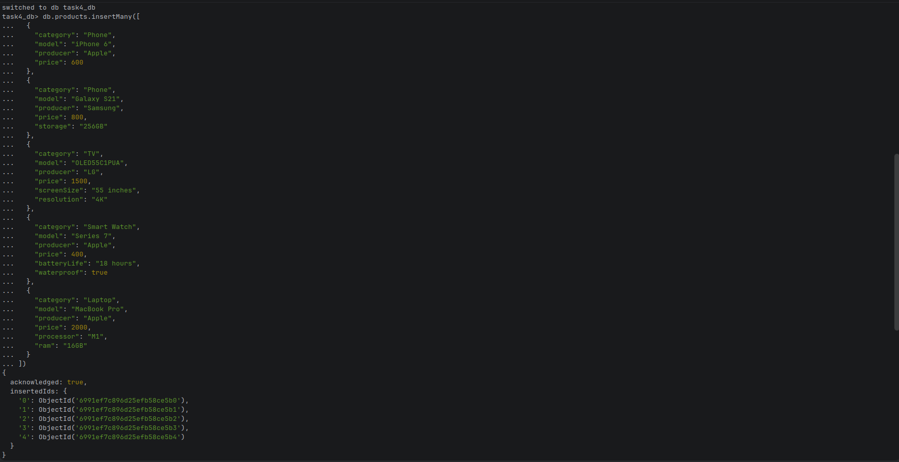
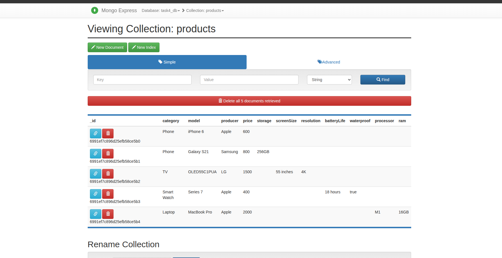

# Task 4: MongoDB Database Operations and Performance Testing




---
## Reqiuirements
- Docker and Docker Compose
- Python 3.8+
- pymongo

**Start MongoDB Container:**
```bash
docker-compose up -d
docker ps
````
**MongoDB CLI:**
```bash
docker exec -it mongodb_container mongosh -u admin -p password
```
**Run Performance Test:**
```
pip install -r requirements.txt
```
```bash
python perf_test.py
```

