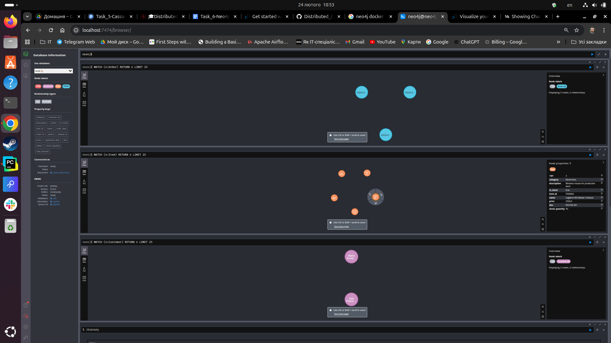
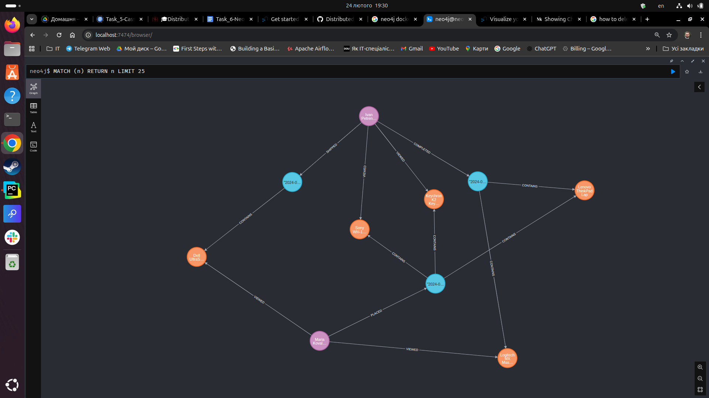

# Task 6: Neo4j Graph Database

#### 1 Create Constraints, Indexes, and Insert Sample Data
```bash
neo4j@neo4j> CREATE CONSTRAINT customer_email_unique IF NOT EXISTS
             FOR (c:Customer) REQUIRE c.email IS UNIQUE;
0 rows
ready to start consuming query after 113 ms, results consumed after another 0 ms
Added 1 constraints
neo4j@neo4j> CREATE CONSTRAINT order_id_unique IF NOT EXISTS
             FOR (o:Order) REQUIRE o.order_id IS UNIQUE;
0 rows
ready to start consuming query after 64 ms, results consumed after another 0 ms
Added 1 constraints
neo4j@neo4j> CREATE CONSTRAINT item_id_unique IF NOT EXISTS
             FOR (i:Item) REQUIRE i.item_id IS UNIQUE;
0 rows
ready to start consuming query after 55 ms, results consumed after another 0 ms
Added 1 constraints
neo4j@neo4j> show constraints;
+----------------------------------------------------------------------------------------------------------------------------------+
| id | name                    | type         | entityType | labelsOrTypes | properties   | ownedIndex              | propertyType |
+----------------------------------------------------------------------------------------------------------------------------------+
| 4  | "customer_email_unique" | "UNIQUENESS" | "NODE"     | ["Customer"]  | ["email"]    | "customer_email_unique" | NULL         |
| 8  | "item_id_unique"        | "UNIQUENESS" | "NODE"     | ["Item"]      | ["item_id"]  | "item_id_unique"        | NULL         |
| 6  | "order_id_unique"       | "UNIQUENESS" | "NODE"     | ["Order"]     | ["order_id"] | "order_id_unique"       | NULL         |
+----------------------------------------------------------------------------------------------------------------------------------+

3 rows
ready to start consuming query after 66 ms, results consumed after another 30 ms
neo4j@neo4j> CREATE INDEX customer_name IF NOT EXISTS FOR (c:Customer) ON (c.name);
             CREATE INDEX item_name IF NOT EXISTS FOR (i:Item) ON (i.name);
             CREATE INDEX order_date IF NOT EXISTS FOR (o:Order) ON (o.order_date);
0 rows
ready to start consuming query after 39 ms, results consumed after another 0 ms
Added 1 indexes
0 rows
ready to start consuming query after 9 ms, results consumed after another 0 ms
Added 1 indexes
0 rows
ready to start consuming query after 19 ms, results consumed after another 0 ms
Added 1 indexes
neo4j@neo4j> CREATE (c1:Customer {
                 customer_id: 'CUST001',
                 name: 'Ivan Petrenko',
                 email: 'ivan.petrenko@example.com',
                 phone: '+380501234567',
                 registered_date: datetime('2023-01-15')
             });
0 rows
ready to start consuming query after 317 ms, results consumed after another 0 ms
Added 1 nodes, Set 5 properties, Added 1 labels
neo4j@neo4j> CREATE (c2:Customer {
                 customer_id: 'CUST002',
                 name: 'Maria Kovalenko',
                 email: 'maria.kovalenko@example.com',
                 phone: '+380502345678',
                 registered_date: datetime('2023-03-20')
             });
0 rows
ready to start consuming query after 58 ms, results consumed after another 0 ms
Added 1 nodes, Set 5 properties, Added 1 labels
>....                                                                                                                                                                                                                                   CREATE (i4:Item {
                 item_id: 'ITEM004',
                 sku: 'MONITOR-001',
                 name: 'Dell UltraSharp 27" Monitor',
                 description: '4K monitor for professional work',
                 price: 12000.00,
                 category: 'Electronics',
                 in_stock: true,
                 stock_quantity: 8
             });
             
             CREATE (i5:Item {
                 item_id: 'ITEM005',
                 sku: 'HEADPHONES-001',
                 name: 'Sony WH-1000XM4 Headphones',
                 description: 'Wireless noise-cancelling headphones',
                 price: 8500.00,
                 category: 'Electronics',
                 in_stock: false,
                 stock_quantity: 0
             });
0 rows
ready to start consuming query after 91 ms, results consumed after another 0 ms
Added 1 nodes, Set 8 properties, Added 1 labels
0 rows
ready to start consuming query after 49 ms, results consumed after another 0 ms
Added 1 nodes, Set 8 properties, Added 1 labels
0 rows
ready to start consuming query after 72 ms, results consumed after another 0 ms
Added 1 nodes, Set 8 properties, Added 1 labels
0 rows
ready to start consuming query after 69 ms, results consumed after another 0 ms
Added 1 nodes, Set 8 properties, Added 1 labels
0 rows
ready to start consuming query after 63 ms, results consumed after another 0 ms
Added 1 nodes, Set 8 properties, Added 1 labels
neo4j@neo4j> CREATE (:Order {
                 order_id: 'ORD001',                                                                                                                                                                                       
                 order_date: datetime('2024-01-15T10:30:00'),
                 status: 'Completed',
                 total_amount: 27500.00});
             
             CREATE (:Order {
                 order_id: 'ORD002',
                 order_date: datetime('2024-02-20T14:15:00'),
                 status: 'Shipped',
                 total_amount: 12000.00
             });
             
             CREATE (:Order {
                 order_id: 'ORD003',
                 order_date: datetime('2024-03-10T09:00:00'),
                 status: 'Processing',
                 total_amount: 25000.00
             });
0 rows
ready to start consuming query after 67 ms, results consumed after another 0 ms
Added 1 nodes, Set 4 properties, Added 1 labels
0 rows
ready to start consuming query after 17 ms, results consumed after another 0 ms
Added 1 nodes, Set 4 properties, Added 1 labels
0 rows
ready to start consuming query after 17 ms, results consumed after another 0 ms
Added 1 nodes, Set 4 properties, Added 1 labels
neo4j@neo4j> MATCH (c:Customer) RETURN 'Customers' AS vertex_type, count(c) AS count
             UNION
             MATCH (i:Item) RETURN 'Items' AS vertex_type, count(i) AS count
             UNION
             MATCH (o:Order) RETURN 'Orders' AS vertex_type, count(o) AS count;
+---------------------+
| vertex_type | count |
+---------------------+
| "Customers" | 2     |
| "Items"     | 5     |
| "Orders"    | 3     |
+---------------------+

eo4j@neo4j> MATCH (c:Customer) return c;
+-----------------------------------------------------------------------------------------------------------------------------------------------------------------+
| c                                                                                                                                                               |
+-----------------------------------------------------------------------------------------------------------------------------------------------------------------+
| (:Customer {name: "Ivan Petrenko", customer_id: "CUST001", registered_date: 2023-01-15T00:00Z, phone: "+380501234567", email: "ivan.petrenko@example.com"})     |
| (:Customer {name: "Maria Kovalenko", registered_date: 2023-03-20T00:00Z, customer_id: "CUST002", phone: "+380502345678", email: "maria.kovalenko@example.com"}) |
+-----------------------------------------------------------------------------------------------------------------------------------------------------------------+

neo4j@neo4j> MATCH (i:Item) return i;
+--------------------------------------------------------------------------------------------------------------------------------------------------------------------------------------------------------------------------+
| i                                                                                                                                                                                                                        |
+--------------------------------------------------------------------------------------------------------------------------------------------------------------------------------------------------------------------------+
| (:Item {item_id: "ITEM001", price: 25000.0, name: "Lenovo ThinkPad Laptop", description: "Professional business laptop", sku: "LAPTOP-001", in_stock: TRUE, category: "Electronics", stock_quantity: 15})                |
| (:Item {item_id: "ITEM002", price: 2500.0, name: "Logitech MX Master 3 Mouse", description: "Wireless mouse for productive work", stock_quantity: 50, sku: "MOUSE-001", in_stock: TRUE, category: "Electronics"})        |
| (:Item {item_id: "ITEM003", price: 3200.0, name: "Keychron K2 Keyboard", description: "Mechanical keyboard", sku: "KEYBOARD-001", in_stock: TRUE, category: "Electronics", stock_quantity: 30})                          |
| (:Item {item_id: "ITEM004", price: 12000.0, name: "Dell UltraSharp 27\" Monitor", description: "4K monitor for professional work", stock_quantity: 8, sku: "MONITOR-001", in_stock: TRUE, category: "Electronics"})      |
| (:Item {item_id: "ITEM005", price: 8500.0, name: "Sony WH-1000XM4 Headphones", description: "Wireless noise-cancelling headphones", in_stock: FALSE, stock_quantity: 0, sku: "HEADPHONES-001", category: "Electronics"}) |
+--------------------------------------------------------------------------------------------------------------------------------------------------------------------------------------------------------------------------+

neo4j@neo4j> MATCH (o:Order) return o;
+-----------------------------------------------------------------------------------------------------------+
| o                                                                                                         |
+-----------------------------------------------------------------------------------------------------------+
| (:Order {order_date: 2024-01-15T10:30Z, total_amount: 27500.0, order_id: "ORD001", status: "Completed"})  |
| (:Order {order_date: 2024-02-20T14:15Z, total_amount: 12000.0, order_id: "ORD002", status: "Shipped"})    |
| (:Order {order_date: 2024-03-10T09:00Z, total_amount: 25000.0, order_id: "ORD003", status: "Processing"}) |
+-----------------------------------------------------------------------------------------------------------+

```


### 2 Create Relationships
```bash

# CUSTOMER-ORDER
neo4j@neo4j>  MATCH (c:Customer {customer_id: 'CUST001'}), (o:Order {order_id: 'ORD001'})
                          CREATE (c)-[:COMPLETED]->(o);
0 rows
ready to start consuming query after 153 ms, results consumed after another 0 ms
Created 1 relationships

neo4j@neo4j> MATCH (c:Customer {customer_id: 'CUST001'}), (o:Order {order_id: 'ORD002'})
                          CREATE (c)-[:SHIPPED]->(o);
0 rows
ready to start consuming query after 79 ms, results consumed after another 0 ms
Created 1 relationships
                                                                                                                                                                                                    
neo4j@neo4j> MATCH (c:Customer {customer_id: 'CUST002'}), (o:Order {order_id: 'ORD003'})
                          CREATE (c)-[:PLACED]->(o);
0 rows
ready to start consuming query after 4 ms, results consumed after another 0 ms
Created 1 relationships

#ORDER-ITEM
neo4j@neo4j> MATCH (o:Order {order_id: 'ORD001'}), (i:Item {item_id: 'ITEM001'})
                          CREATE (o)-[:CONTAINS {quantity: 1}]->(i);
0 rows
ready to start consuming query after 106 ms, results consumed after another 0 ms
Created 1 relationships, Set 1 properties
neo4j@neo4j> MATCH (o:Order {order_id: 'ORD001'}), (i:Item {item_id: 'ITEM002'})
                          CREATE (o)-[:CONTAINS {quantity: 2}]->(i);
0 rows
ready to start consuming query after 31 ms, results consumed after another 0 ms
Created 1 relationships, Set 1 properties
neo4j@neo4j> MATCH (o:Order {order_id: 'ORD002'}), (i:Item {item_id: 'ITEM004'})
                          CREATE (o)-[:CONTAINS {quantity: 1}]->(i);
0 rows
ready to start consuming query after 34 ms, results consumed after another 0 ms
Created 1 relationships, Set 1 properties
neo4j@neo4j> MATCH (o:Order {order_id: 'ORD003'}), (i:Item {item_id: 'ITEM001'})
                          CREATE (o)-[:CONTAINS {quantity: 1}]->(i);
0 rows
ready to start consuming query after 48 ms, results consumed after another 0 ms
Created 1 relationships, Set 1 properties
neo4j@neo4j> MATCH (o:Order {order_id: 'ORD003'}), (i:Item {item_id: 'ITEM003'})
                          CREATE (o)-[:CONTAINS {quantity: 1}]->(i);
0 rows
ready to start consuming query after 21 ms, results consumed after another 0 ms
Created 1 relationships, Set 1 properties
neo4j@neo4j> MATCH (o:Order {order_id: 'ORD003'}), (i:Item {item_id: 'ITEM005'})
                          CREATE (o)-[:CONTAINS {quantity: 1}]->(i);
0 rows
ready to start consuming query after 42 ms, results consumed after another 0 ms
Created 1 relationships, Set 1 properties

# CUSTOMER-ITEM
neo4j@neo4j> MATCH (c:Customer {customer_id: 'CUST001'}), (i:Item {item_id: 'ITEM005'})
             CREATE (c)-[:VIEWED {
                 viewed_at: datetime('2024-02-01T10:00:00'),
                 duration_seconds: 90
             }]->(i);
             
             MATCH (c:Customer {customer_id: 'CUST002'}), (i:Item {item_id: 'ITEM002'})
             CREATE (c)-[:VIEWED {
                 viewed_at: datetime('2024-03-09T16:35:00'),
                 duration_seconds: 30
             }]->(i);
             
             MATCH (c:Customer {customer_id: 'CUST002'}), (i:Item {item_id: 'ITEM004'})
             CREATE (c)-[:VIEWED {
                 viewed_at: datetime('2024-03-09T16:30:00'),
                 duration_seconds: 180
             }]->(i);
0 rows
ready to start consuming query after 135 ms, results consumed after another 0 ms
Created 1 relationships, Set 2 properties
0 rows
ready to start consuming query after 37 ms, results consumed after another 0 ms
Created 1 relationships, Set 2 properties
0 rows
ready to start consuming query after 31 ms, results consumed after another 0 ms
Created 1 relationships, Set 2 properties
neo4j@neo4j> MATCH (c:Customer {customer_id: 'CUST001'}), (i:Item {item_id: 'ITEM003'})
             CREATE (c)-[:VIEWED {
                 viewed_at: datetime('2024-01-14T15:25:00'),
                 duration_seconds: 45
             }]->(i);
0 rows
ready to start consuming query after 23 ms, results consumed after another 0 ms
Created 1 relationships, Set 2 properties
neo4j@neo4j> 
```



### 3 Querying the Graph
```bash
# Знайти Items які входять в конкретний Order
neo4j@neo4j> MATCH (o:Order {order_id: 'ORD001'})-[r:CONTAINS]->(i:Item)
             RETURN o.order_id AS order_id,
                 i.item_id AS item_id,
                 i.name AS item_name,
                 r.quantity AS quantity,
                 i.price AS unit_price,
                 i.price * r.quantity AS subtotal;
+----------------------------------------------------------------------------------------+
| order_id | item_id   | item_name                    | quantity | unit_price | subtotal |
+----------------------------------------------------------------------------------------+
| "ORD001" | "ITEM002" | "Logitech MX Master 3 Mouse" | 2        | 2500.0     | 5000.0   |
| "ORD001" | "ITEM001" | "Lenovo ThinkPad Laptop"     | 1        | 25000.0    | 25000.0  |
+----------------------------------------------------------------------------------------+

2 rows

#Підрахувати вартість конкретного Order
eo4j@neo4j> MATCH (o:Order {order_id:'ORD001'})-[r:CONTAINS]->(i:Item)
             WITH o.order_id AS order_id, sum(i.price * r.quantity) AS total_price
             RETURN order_id, total_price
             ORDER BY order_id;
+------------------------+
| order_id | total_price |
+------------------------+
| "ORD001" | 30000.0     |
+------------------------+

1 row

#Знайти всі Orders конкретного Customer
+---------------------------------------------------------------+
| o.order_id | o.status    | o.order_date      | o.total_amount |
+---------------------------------------------------------------+
| "ORD002"   | "Shipped"   | 2024-02-20T14:15Z | 12000.0        |
| "ORD001"   | "Completed" | 2024-01-15T10:30Z | 27500.0        |
+---------------------------------------------------------------+

2 rows

# Знайти всі Items куплені конкретним Customer та їх кількість (через Order)
neo4j@neo4j> MATCH (c:Customer {customer_id: 'CUST001'})-[]->(o:Order)-[r:CONTAINS]->(i:Item)
             RETURN
                 c.name AS customer,
                 collect({item: i.name, quantity: r.quantity}) AS purchased_items,
                 sum(r.quantity) AS total_items_count;
+-----------------------------------------------------------------------------------------------------------------------------------------------------------------------------------------------+
| customer        | purchased_items                                                                                                                                         | total_items_count |
+-----------------------------------------------------------------------------------------------------------------------------------------------------------------------------------------------+
| "Ivan Petrenko" | [{item: "Dell UltraSharp 27\" Monitor", quantity: 1}, {item: "Logitech MX Master 3 Mouse", quantity: 2}, {item: "Lenovo ThinkPad Laptop", quantity: 1}] | 4                 |
+-----------------------------------------------------------------------------------------------------------------------------------------------------------------------------------------------+

1 row

# Знайті скільки разів кожен товар був придбаний, відсортувати за цим значенням
MATCH (o:Order)-[r:CONTAINS]->(i:Item)
             RETURN
                 i.name AS item_name,
                 count(o) AS times_purchased,
                 sum(r.quantity) AS total_quantity,
                 i.price AS unit_price,
                 sum(i.price * r.quantity) AS total_revenue
             ORDER BY times_purchased DESC;
             

# Знайти всі Items переглянуті (view) конкретним Customer
neo4j@neo4j> MATCH (c:Customer {customer_id: 'CUST001'})-[v:VIEWED]->(i:Item)
             RETURN
                 c.name AS customer,
                 count(i) AS items_viewed,
                 collect(i.name) AS viewed_items,
                 sum(v.duration_seconds) AS total_viewing_time_seconds;
+----------------------------------------------------------------------------------------------------------------------+
| customer        | items_viewed | viewed_items                                           | total_viewing_time_seconds |
+----------------------------------------------------------------------------------------------------------------------+
| "Ivan Petrenko" | 2            | ["Keychron K2 Keyboard", "Sony WH-1000XM4 Headphones"] | 135                        |
+----------------------------------------------------------------------------------------------------------------------+

1 row

# Знайти інші Items що купувались разом з конкретним Item (тобто всі Items що входять до Order-s разом з даними Item)
neo4j@neo4j> MATCH (target:Item {item_id: 'ITEM001'})<-[:CONTAINS]-(o:Order)-[:CONTAINS]->(other:Item)
             WHERE other.item_id <> target.item_id
             WITH other, count(DISTINCT o) AS frequency
             RETURN
                 other.name AS item_name,
                 other.price AS price,
                 frequency AS bought_together_count
             ORDER BY frequency DESC, other.name;
+---------------------------------------------------------------+
| item_name                    | price  | bought_together_count |
+---------------------------------------------------------------+
| "Keychron K2 Keyboard"       | 3200.0 | 1                     |
| "Logitech MX Master 3 Mouse" | 2500.0 | 1                     |
| "Sony WH-1000XM4 Headphones" | 8500.0 | 1                     |
+---------------------------------------------------------------+

3 rows

# Знайти Customers які купили даний конкретний Item

MATCH (c:Customer)-[]->(o:Order)-[r:CONTAINS]->(i:Item {item_id: 'ITEM001'})
RETURN
    c.customer_id AS customer_id,
    c.name AS customer_name,
    c.email AS email,
    count(DISTINCT o) AS orders_count,
    sum(r.quantity) AS total_quantity_purchased
ORDER BY total_quantity_purchased DESC, customer_name;

# Знайти для певного Customer(а) товари, які він переглядав, але не купив
MATCH (c:Customer {customer_id: 'CUST001'})-[:VIEWED]->(i:Item)
             WHERE NOT EXISTS {
                 MATCH (c)-[:PLACED|COMPLETED|SHIPPED]->(o:Order)-[:CONTAINS]->(i)
             }
             RETURN
                 c.name AS customer,
                 i.item_id AS item_id,
                 i.name AS item_name,
                 i.price AS price,
                 i.in_stock AS in_stock
             ORDER BY i.name;
             
+--------------------------------------------------------------------------------+
| customer        | item_id   | item_name                    | price  | in_stock |
+--------------------------------------------------------------------------------+
| "Ivan Petrenko" | "ITEM003" | "Keychron K2 Keyboard"       | 3200.0 | TRUE     |
| "Ivan Petrenko" | "ITEM005" | "Sony WH-1000XM4 Headphones" | 8500.0 | FALSE    |
+--------------------------------------------------------------------------------+
```

### 4 Performance Testing
```bash
(.venv) vkhvorostianyi@vkhvorostianyi-Latitude-E6440:~/PycharmProjects/Distributed_Databases/task6$ python perf_test.py
Initialized likes to 0
Client 6 completed 10000 increments
Client 10 completed 10000 increments
Client 4 completed 10000 increments
Client 9 completed 10000 increments
Client 5 completed 10000 increments
Client 7 completed 10000 increments
Client 2 completed 10000 increments
Client 8 completed 10000 increments
Client 3 completed 10000 increments
Client 1 completed 10000 increments

============================================================
Performance Test Results:
============================================================
Expected likes: 100000
Final likes: 100000
Difference: 0
Execution time: 273.27 seconds
Operations per second: 365.94
============================================================
(.venv) vkhvorostianyi@vkhvorostianyi-Latitude-E6440:~/PycharmProjects/Distributed_Databases/task6$ 
```

```bash
pip install -r requirements.txt
python perf_test.py
```